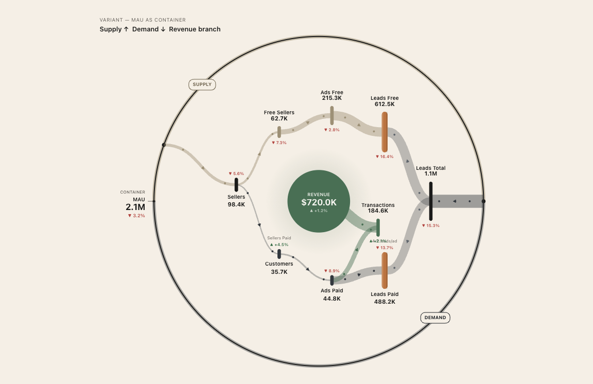

# Khanin Diagram

Circular flow diagram for unit economics visualization. Standalone JavaScript library with zero dependencies. Canvas rendering with SVG export.



## Why Khanin Diagram?

Two-sided business models share a common pattern: one source of users splits into two groups — one side generates supply, the other pays and generates revenue. Traditional funnels and Sankey diagrams fail to show this circular relationship clearly.

Khanin Diagram visualizes both sides of the business as a single circular flow from a shared user base, making it easy to see how supply and demand interact and where the money comes from.

**Use cases:**

- **Classifieds & marketplaces** (OLX, Craigslist, Facebook Marketplace) — free listings vs. paid promotion
- **Ride-hailing & delivery** (Uber, Bolt, DoorDash) — drivers vs. riders
- **EdTech platforms** (Coursera, Udemy, Khan Academy) — free learners vs. paying students
- **HR & recruiting** (Indeed, LinkedIn, Glassdoor) — job seekers vs. employers who pay for access
- **Freemium SaaS** — free users who create content vs. paying subscribers
- **Media & advertising** — audience (free) vs. advertisers (paid)

Any model where one group uses the product for free and the other pays — and both originate from the same user pool — is a fit for this diagram.

## Features

- Circular layout with supply/demand zones
- Animated flows between nodes
- Delta indicators (growth/decline)
- Central metric (revenue, profit, etc.)
- Container metric (MAU, users, etc.)
- SVG export
- No dependencies

## Quick Start

```html
<div id="diagram"></div>
<script src="khanin-diagram.js"></script>
<script>
var diagram = KhaninDiagram(document.getElementById('diagram'), {
  container: { label: "MAU", value: 2150000, delta: -3.2 },
  center:    { label: "Revenue", value: 720000, delta: +1.2, format: "money" },

  zones: [
    { id: "supply", label: "SUPPLY", arc: [180, 360], color: "#A89B7E" },
    { id: "demand", label: "DEMAND", arc: [0, 180],   color: "#3A4047" }
  ],

  nodes: [
    { id: "sellers",     label: "Sellers",      value: 98400,  delta: -5.6, zone: "supply" },
    { id: "freeSellers", label: "Free Sellers", value: 62700,  delta: -7.3, zone: "supply" },
    { id: "customers",   label: "Customers",    value: 35700,  delta: +4.5, zone: "demand" },
    { id: "transactions",label: "Transactions", value: 184600, delta: +2.1, zone: "demand" }
  ],

  flows: [
    { from: "container",    to: "sellers",      value: 98400 },
    { from: "sellers",      to: "freeSellers",  value: 62700 },
    { from: "sellers",      to: "customers",    value: 35700 },
    { from: "transactions", to: "center",       value: 720000 }
  ]
});
</script>
```

## API

### `KhaninDiagram(element, config)`

Creates a diagram instance.

- **element** — DOM container
- **config** — configuration object (see below)

Returns an instance with methods:

| Method | Description |
|--------|-------------|
| `update(config)` | Update diagram with new config |
| `toSVG()` | Export as SVG string |
| `destroy()` | Remove diagram and clean up |

### Config

| Property | Description |
|----------|-------------|
| `container` | Outer ring metric: `{ label, value, delta }` |
| `center` | Central metric: `{ label, value, delta, format }` |
| `zones` | Array of zones: `{ id, label, arc: [start, end], color }` |
| `nodes` | Array of nodes: `{ id, label, value, delta, zone, group }` |
| `flows` | Array of flows: `{ from, to, value, group }` |
| `layout` | Node positions: `{ nodeId: { x, y } }` (normalized -1..1) |
| `colors` | Color overrides: `{ ring, background, up, down, text, muted, centerFill }` |
| `animation` | `{ enabled: true, speed: 0.18 }` |

## License

[BSL 1.1](LICENSE) — Business Source License 1.1

Copyright (c) 2026 Daniil Khanin and Khanin Solutions S.L.
